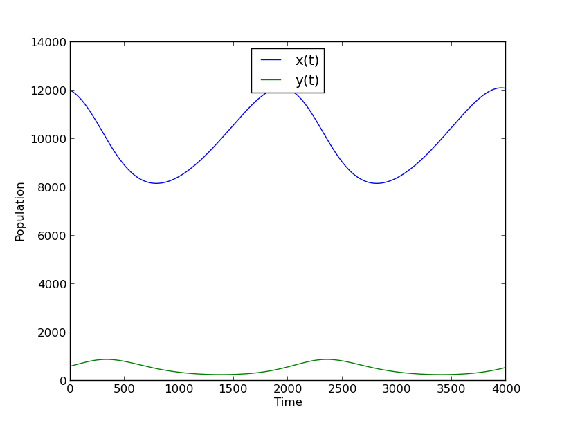

% Modeling and Performance Analysis with Simulation
% Martin Lenders (4206090)

<!-- read external R code -->
```{r reading, echo=FALSE}
read_chunk("ue01.r")
```

Übung 1
=======

Problem 1: Komponenten eines Systems
------------------------------------
### Komponenten
System      Entitäten       Attribute                       Aktivitäten     Ereignisse           Zustandsvariablen 
-------     -------------   ------------------------------  -------------   -----------------    --------------------------
a)          Fußgänger       Geschwindigkeit                 Laufen          Ende der Bewegung    Geschwindigkeit          
                            Position                                                             Position                 
b)          Hosts           Paketdurchsatz                  Senden          Paketankunft         Pakete in der Queue      
            Verbindungen                                    Empfangen
                                                            Übertragen
c)          Access-Points   Übertragungsgeschwindigkeit     Senden          Paketankunft         Menge angemeldeten Clients
            Clients                                         Empfangen       Client angemeldet    Pakete in der Queue
                                                            Anmelden        Client abgemeldet    Belegung des Mediums
                                                            Abmelden                             Menge der verbundenen APs

### Performance-Metriken:
a) „Viskosität“ der Masse:
    * Einzelgeschwindigkeiten + Menge der Entitäten im Umfeld in Position als Vektorraum
    * Felder langsamer Geschwindigkeit mit hohe Entitätenmenge $\Rightarrow$ hohe „Viskosität“
    * Felder hoher Geschwindigkeit mit jeder Entitätenmenge $\Leftarrow$ geringe „Viskosität“
    * Ziel: geringe „Viskosität“
b) Response Time zwischen 2 Hosts
c) Paketdurchsatz

### Modellierungstechnik
a) Objekt-Orientiertes Modell mit einer Objektart: Fußgänger
b) Allgemeiner Graph: Hosts = Knoten, Verbindungen = Kanten
c) Allgemeiner Graph über Zeit: APs und Clients = Knoten, angemeldete Clients und APs = Kanten


Problem 2: Prozess einer Simulatiosstudie
-----------------------------------------

Problem 3: Monte Carlo Simulation
---------------------------------
~~~python
import random

shots = 0
hits = 0

def shoot():
    global shots
    x = random.uniform(0,1)
    y = random.uniform(0,1)
    shots += 1
    return x,y

def is_hit(x,y):
    return (x*x + y*y) <= 1

def approx_pi(iterations):
    global shots, hits
    shots, hits = 0.0, 0.0
    for i in range(iterations):
        x,y = shoot()
        if is_hit(x,y):
            hits += 1
    return hits/shots*4
~~~

Die Ergebnisse von 1000 Durchläufen von Simulationen mit den geforderten Werten
lassen wir uns in zwei CSV-Dateien ausgeben. Eine für die Ausführungszeiten
und eine für die Differenzen zu Pi.
Diese lesen wir dann mit R ein
```{r}
<<read-ue01-3-data>>
```
und lassen uns Box-and-Whisker-Plots für die Ausführungszeit
```{r plot-time, result="asis", fig.cap="Ausführungszeit der Monte-Carlo-Simulation"}
<<plot-ue01-3-data-time>>
```
und für die Differenz zu $\pi$ ausgeben.
```{r plot-diff, result="asis", fig.cap="Differenz zu Pi des Ergebnisses der Monte-Carlo-Simulation"}
<<plot-ue01-3-data-diff>>
```

Problem 4: Dynamische kontinuierliche Simulation
------------------------------------------------
Da wir die Lösung von Differentialgleichungssystemen nicht selbst implementieren
wollen, verwenden wir einfach SciPy:

~~~python
import scipy
from scipy.integrate import odeint

def predpray(a, b, r, s, x_0, y_0, t_start, t_stop, t_samplerate):
    def derivative((x_t, y_t), t):
        dx = r * x_t - a * x_t * y_t
        dy = -s * y_t + b * x_t * y_t
        return (dx, dy)

    t = scipy.arange(t_start, t_stop, t_samplerate)
    species = scipy.array((x_0,y_0))

    return odeint(derivative, species, t)
~~~

Der Plot für die gegebenen Parameter ist in Figure 3 


